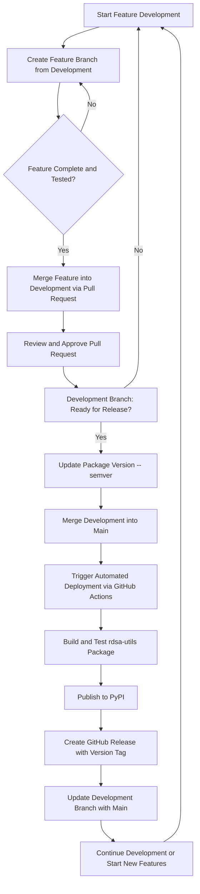

# Branching and Deployment Guide

## Overview

Our branching strategy is designed to support Continuous Integration and 
Continuous Deployment, ensuring smooth transitions between development, 
testing, and production. 

This framework aims to maintain a stable codebase and streamline collaboration, 
by separating in-progress work from production-ready content. 

The goal is to streamline our workflow, making it easier to integrate new features, 
fix bugs, and release updates promptly.

## Branches

- **Main Branch**: Stable codebase reflecting the current production state.
- **Development Branch**: Active development branch where new features, bug fixes, 
and improvements are merged.

## Development Workflow

1. **Feature Branches**: 
    - All new features and bug fixes are developed in separate branches created from 
     the `development` branch.
    - **Branch Naming Conventions**:
        - **Feature Branches**: `feature-<feature_name>` for introducing new features.
        - **Bug Fixes**: `fix-<bug_description>` for resolving bugs.
        - **Hotfixes**: `hotfix-<issue>` for urgent fixes that go straight to production.
        - **Improvements/Refactors**: `refactor-<description>` or `improvement-<description>` for code improvements.
        - **Documentation**: `docs-<change_description>` for updates to documentation.
        - **Experimental**: `experiment-<experiment_name>` for trial and exploratory work.

2. **Merging to Development**:
    - Once a feature is complete and tested, it is merged into the `development` branch 
    through a pull request.
    - Pull requests should be reviewed and approved by at least one other developer.

3. **Version Bumping**:
    - Before merging `development` into `main`, update the package version. 
    [Follow semantic versioning principles (MAJOR.MINOR.PATCH).](https://semver.org/)
    - Use `bump2version` to bump `rdsa-utils` package version. 
    Example: `bump2version patch` (for a patch update), 
    `bump2version minor` (for a minor update), 
    or `bump2version major` (for a major update).

4. **Merging to Main**:
    - After a set of features is finalised in the `development` branch, and 
    the package version is bumped, merge `development` into `main`.
    - This action triggers the automated deployment process 
    through GitHub Actions.

5. **Post-Merge Update**:
    - After merging into `main`, update the `development` branch with the 
    latest `main` branch changes. This ensures `development` is aligned with production.

## Deployment Process Using GitHub Actions

### Overview

The deployment process is automated using GitHub Actions. This CI/CD pipeline is 
triggered upon merging changes into the `main` branch.

### Steps in the Deployment Pipeline

1. **Trigger**:
    - The pipeline is triggered when a merge into `main` is detected.

2. **Build**:
    - The `rdsa-utils` package is built. Ensure that all tests are passed 
    and quality checks are satisfied.

3. **Publish to PyPI**:
    - The built package is published to the Python Package Index (PyPI).

4. **Create GitHub Release**:
    - A GitHub Release is created with the new version tag.
    - Built artifacts, such as wheels or source distributions, are uploaded to this release.

## Git Workflow Diagram

Below is a visual representation of our Git workflow, illustrating the process 
from feature development through to deployment using GitHub Actions.



## Merging Development to Main: A Guide for Maintainers

As `rdsa-utils` maintainers, ensuring a seamless transition from `development` to the `main`
branch is essential. This process extends beyond mere code merging; it encompasses careful 
preparation, version management, and detailed documentation to preserve the codebase's integrity 
and reliability. Below is a straightforward guide on the procedure:

### Preparation

- **Initiate Merge Request**:
    - Navigate to the GitHub repository's page and access the **'Pull Requests'** section.
    - Click on **'New Pull Request'** to start the merging process. Select the `development` 
      branch as the source and the `main` branch as the target.
    - Title the Merge Request with a relevant name that succinctly describes the set of 
      features, fixes, or improvements being merged. 
      Example: "Release 1.2.0: Feature Enhancements and Bug Fixes".

### Review and Approval

- **Review Changes**:
    - Utilise GitHub's User Interface (UI) to review the changes introduced. This is 
      critical for spotting any potential issues before they make it into the `main` branch.
    - Cross-reference the changes against the `CHANGELOG.md` file to ensure all updates, 
      fixes, and new features are properly documented.

- **Approve Changes**:
    - Once satisfied with the review, click on the **"Review changes"** button in GitHub 
      and select **"Approve"** from the options. This indicates that the changes have been 
      reviewed and are considered ready for merging. If you're reviewing multiple files, 
      click on the **"Viewed"** checkbox for each file as you review them. This helps 
      manage and streamline the review process by marking files that have already been 
      checked.

### Version Management and Documentation

- **Bump Version**:
    - Before merging, it's essential to update the package version. Use the `bump2version`
      command line tool to increment the version according to the nature of the changes 
      (patch, minor, or major). For example, run `bump2version patch` for a patch update 
      in your local development environment.

- **Update CHANGELOG.md**:
    - In the `CHANGELOG.md` file, create a new header/section for the newly bumped version.
    - Move all entries from the **"Unreleased"** section to the **new version section**. 
    This action effectively transfers the documentation of changes from being pending 
    release to being part of the new version's official changelog.
    - Ensure the **"Unreleased"** section is left empty after this process, 
    ready for documenting future changes.

- **Update `CHANGELOG.md` Release Links**:
    - After bumping the version and updating the `CHANGELOG.md` with the new version 
    header and changes, proceed to update the **"Release Links"** section at the bottom 
    of the document. Add links to the new version's GitHub Release page and its PyPI listing, 
    following the existing format. For example:
        
        ```
        - rdsa-utils v0.1.9: [GitHub Release](https://github.com/ONSdigital/rdsa-utils/releases/tag/v0.1.9) | 
        [PyPI](https://pypi.org/project/rdsa-utils/0.1.9/)
        ```

    This step ensures users and developers can easily find and access the specific 
    versions of `rdsa-utils` through their respective release pages and download links, 
    maintaining a comprehensive and navigable documentation.

- **Final Review and Push**:
    - Review the changes one more time, ensuring that the version bump and `CHANGELOG.md` 
      updates are correctly applied.
    - Push the commit(s) to the `development` branch. This action updates the 
      branch with the version change and changelog updates.

### Merging and Deployment

- **Merge to Main**:
    - With all preparations complete and changes reviewed, proceed to merge 
      the `development` branch into the `main` branch.
    - This action can be done through the GitHub UI by completing the pull request 
      initiated in the **Preparation** section of the guide.
    - Merging to `main` automatically triggers the GitHub Actions workflow for deployment, 
      which includes building the package, publishing to PyPI, and creating a 
      GitHub Release with the new version tag.

### Synchronizing Development Branch Post-Merge

After the pull request from `development` to `main` has been merged, it is crucial to 
synchronise the `development` branch with the changes in `main`. Perform the following 
steps to ensure that `development` stays up-to-date:

- **Pull Changes from Main**:
    - Execute `git pull origin main` to fetch and merge the latest changes from 
      the `main` branch into your current branch.

- **Switch to Development Branch**:
    - Use `git checkout development` to switch from your current branch 
      to the `development` branch.

- **Merge Main into Development**:
    - Run `git merge main` while on the `development` branch to merge the 
      changes from the `main` branch into `development`.

- **Push Updated Development**:
    - After merging, push the updated `development` branch back to the remote 
      repository using `git push origin development`.

These commands ensure that the `development` branch reflects the latest 
state of `main`, maintaining consistency across your project's branches.

By adhering to these steps, you'll make the transition from development to production 
smooth and efficient, ensuring the codebase remains stable and the release process flows 
seamlessly. As maintainers, your pivotal role guarantees the `rdsa-utils` package's 
reliability and efficiency for all users.