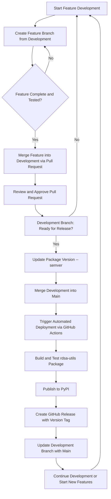

# Branching and Deployment Guide

## Overview

Our branching strategy is designed to support continuous integration and 
continuous deployment, ensuring smooth transitions between development, 
testing, and production. 

This framework aims to maintain a stable codebase and streamline collaboration, 
by separating in-progress work from production-ready content. 

The goal is to streamline our workflow, making it easier to integrate new features, 
fix bugs, and release updates promptly.

## Branches

- **Main Branch**: Stable codebase reflecting the current production state.
- **Development Branch**: Active development branch where new features, bug fixes, 
and improvements are merged.

## Development Workflow

1. **Feature Branches**: 
    - All new features and bug fixes are developed in separate branches created from 
     the `development` branch.
    - **Branch Naming Conventions**:
        - **Feature Branches**: `feature-<feature_name>` for introducing new features.
        - **Bug Fixes**: `fix-<bug_description>` for resolving bugs.
        - **Hotfixes**: `hotfix-<issue>` for urgent fixes that go straight to production.
        - **Improvements/Refactors**: `refactor-<description>` or `improvement-<description>` for code improvements.
        - **Documentation**: `docs-<change_description>` for updates to documentation.
        - **Experimental**: `experiment-<experiment_name>` for trial and exploratory work.

2. **Merging to Development**:
    - Once a feature is complete and tested, it is merged into the `development` branch 
    through a pull request.
    - Pull requests should be reviewed and approved by at least one other developer.

3. **Version Bumping**:
    - Before merging `development` into `main`, update the package version. 
    [Follow semantic versioning principles (MAJOR.MINOR.PATCH).](https://semver.org/)
    - Use `bump2version` to bump `rdsa-utils` package version. 
    Example: `bump2version patch` (for a patch update), 
    `bump2version minor` (for a minor update), 
    or `bump2version major` (for a major update).

4. **Merging to Main**:
    - After a set of features is finalised in the `development` branch, and 
    the package version is bumped, merge `development` into `main`.
    - This action triggers the automated deployment process 
    through GitHub Actions.

5. **Post-Merge Update**:
    - After merging into `main`, update the `development` branch with the 
    latest `main` branch changes. This ensures `development` is aligned with production.

## Deployment Process Using GitHub Actions

### Overview

The deployment process is automated using GitHub Actions. This CI/CD pipeline is 
triggered upon merging changes into the `main` branch.

### Steps in the Deployment Pipeline

1. **Trigger**:
    - The pipeline is triggered when a merge into `main` is detected.

2. **Build**:
    - The `rdsa-utils` package is built. Ensure that all tests are passed 
    and quality checks are satisfied.

3. **Publish to PyPI**:
    - The built package is published to the Python Package Index (PyPI).

4. **Create GitHub Release**:
    - A GitHub Release is created with the new version tag.
    - Built artifacts, such as wheels or source distributions, are uploaded to this release.

## Git Workflow Diagram

Below is a visual representation of our Git workflow, illustrating the process 
from feature development through to deployment using GitHub Actions.

