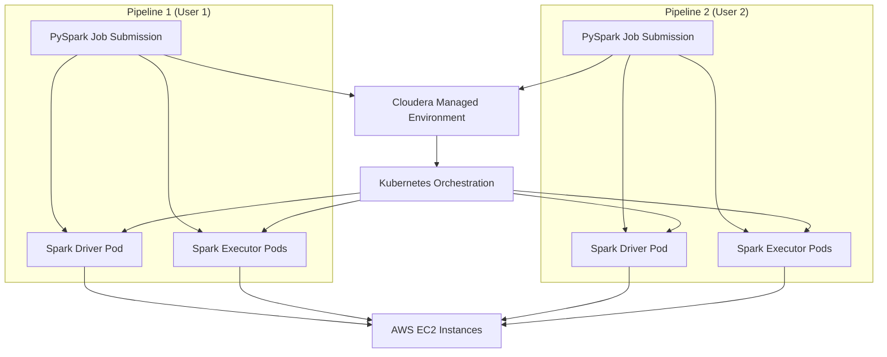
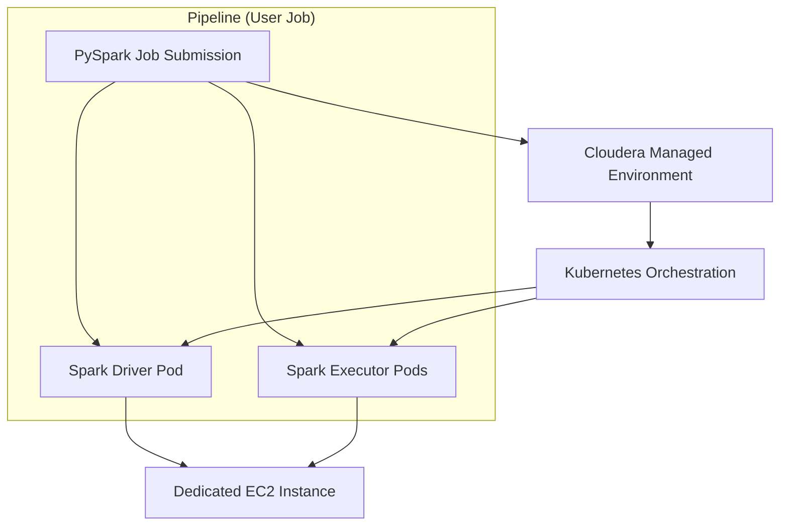
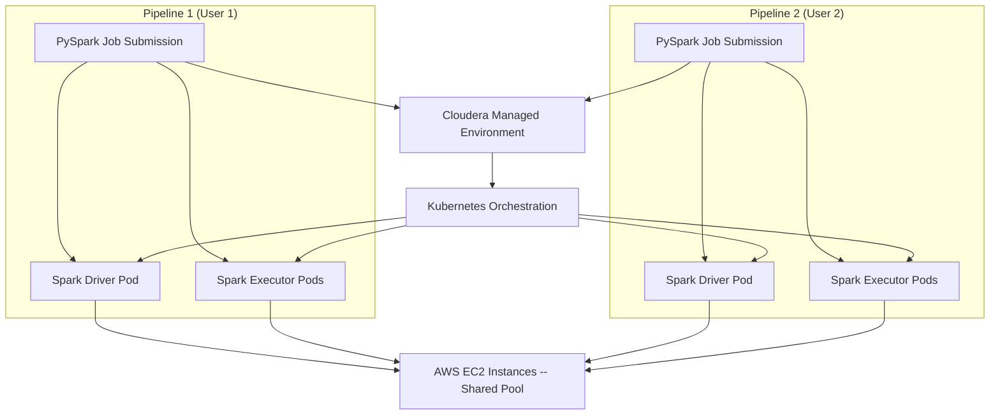

# Estimating AWS Costs from PySpark Event Logs in a Managed Cloudera Environment

This report details a methodology for estimating AWS EC2 costs using PySpark event logs
in a managed Cloudera environment that leverages Kubernetes orchestration.

It explains the challenges of cost estimation in a shared infrastructure scenario,
outlines the assumptions made for a simplified estimate,
and discusses the implications of the “noisy neighbour” problem.

## 1. Managed Environment on Cloudera with AWS Backend

### What Is a Managed Environment?

In a managed environment like Cloudera deployed on AWS:

- **Automated Provisioning and Management**: The platform handles provisioning,
  configuration, scaling, and maintenance of the infrastructure.
  Users do not manually select individual EC2 instances.

- **Kubernetes-Based Orchestration**: Spark applications are run as sets of pods
  (driver and executors) managed by Kubernetes.
  When you submit a PySpark pipeline, Cloudera automatically provisions
  the necessary pods, and the Kubernetes scheduler assigns these pods to underlying
  EC2 instances based on resource requirements.

- **Shared Infrastructure**: Although each pipeline (or mini-cluster) is logically isolated,
  multiple pipelines can share the same pool of EC2 instances. The underlying nodes host
  pods from different users, leading to efficient resource usage. AWS bills based on
  the total duration the EC2 instances are active, regardless of how many pipelines
  share those resources.

### Opposite: A Self-Managed Environment

In a self-managed environment, you manually launch and configure EC2 instances,
set up Spark, and handle scaling and maintenance. This approach offers granular
control but increases operational overhead and risks misconfiguration.

Moreover, in self-managed clusters, you might be able to tightly monitor resource
usage per pipeline; however, cost optimisation becomes more complex when handling
varied workloads.

## 2. The “Noisy Neighbour” Problem in Shared Kubernetes Environments

In a Kubernetes-managed Cloudera environment:

- **Resource Sharing**: Multiple users’ pipelines run concurrently on the same
  underlying EC2 instances. Although each pipeline is isolated at the pod level,
  they share the same hardware resources.

- **Noisy Neighbours**: One pipeline (or a “noisy neighbour”) that consumes an unusually
  high amount of CPU or memory may impact the performance of other pipelines sharing
  the same node. However, the resource scheduler in Kubernetes generally mitigates
  this by enforcing resource limits and priorities.

- **Billing Implications**: Since AWS charges are based on the total duration that
  EC2 instances are active (not per pod), the cost estimation becomes challenging
  when resources are shared. It is hard to assign a precise cost to an individual
  pipeline when multiple pipelines run on the same node.

- **Simplified Assumption for Estimation**: For ease of estimation, we assume a
  scenario where each pipeline spins up its own dedicated mini-cluster
  (i.e., a set of pods that run exclusively on their own dedicated EC2 instance).
  This assumption simplifies cost calculation by attributing the entire cost of an
  EC2 instance to one pipeline, even though, in reality, the infrastructure is
  shared among many users.

## 3. Methodology for Cost Estimation

### Session Duration as a Proxy for Billed Time.

- **Extraction Method:** By parsing the PySpark event logs, we extract the session’s
  start and end times. Events such as `SparkListenerApplicationStart`
  and `SparkListenerApplicationEnd` mark these boundaries.

- **Assumption:** The total session duration reflects the time during which the cluster
  (or the pods on Kubernetes) is provisioned. AWS bills for the full duration that
  the EC2 instances are active, including idle periods.

### Resource Configuration and Mapping to EC2 Billing

Key Spark configuration parameters are extracted:

- `spark.dynamicAllocation.maxExecutors`
- `spark.executor.cores`
- `spark.executor.memory`

### Calculation

The maximum resources available for a pipeline are approximated by multiplying
the number of executors by the per-executor cores (which roughly map to vCPUs)
and memory.

- **Simplified Assumption for Estimation**:
For cost estimation, we assume that each pipeline’s mini-cluster runs on dedicated EC2
instances. This simplifies the model by treating the total vCPUs (or cores) and memory
allocated to the pipeline as if they were provisioned on isolated instances. Although,
in a shared Kubernetes environment, multiple pipelines share the underlying hardware,
this assumption provides a conservative upper-bound estimate.

### Why This Estimate Is a Reasonable Rough Guess

- **Billing Alignment**: AWS bills based on the active time of EC2 instances. Using the
  session start and end times captures the full duration during which resources
  are provisioned, reflecting what you would be billed.

- **Upper-Bound Estimate**: Including idle periods provides an upper-bound cost estimate,
  which is practical for budgeting and cost management discussions with management.

- **Simplification in a Complex Environment**: Aggregating fine-grained, task-level metrics
  in a dynamic, multi-tenant environment is challenging due to overlapping tasks,
  dynamic scaling, and shared resource usage. The session-based approach avoids
  these pitfalls by focusing on the overall provisioning time.

- **Assumed Dedicated Instance Model**: While multiple users typically share EC2 instances,
  the assumption that each pipeline gets its own dedicated instance simplifies
  cost estimation. This assumption is particularly useful for explaining the
  methodology to management, even though it might not precisely mirror the
  actual shared infrastructure setup.

## 4. Visualising the Architecture

### 4.1. Cloudera-Managed Environment with Kubernetes Orchestration

Below is a Mermaid diagram that illustrates the logical flow of pipelines
in a Cloudera-managed environment with Kubernetes orchestration:



#### Diagram Explanation:

- **Pipeline Isolation:** Each user’s pipeline is represented as an
  isolated mini-cluster with its own driver and executor pods.

- **Shared Management & Orchestration:** The Cloudera managed environment,
  together with Kubernetes, abstracts the underlying resource scheduling and management.

- **Underlying Infrastructure:** All pods are deployed on AWS EC2 instances.
  Although each pipeline is logically isolated, they share the same pool of
  EC2 instances, which may lead to “noisy neighbour” challenges.

- **Simplified Estimation Assumption:** For the purposes of cost estimation,
  we assume that each pipeline’s pods run on dedicated EC2 instances—even
  though in reality, the infrastructure is shared. This simplifies mapping
  session duration and resource configuration directly to AWS billing.

### 4.2. Diagram Comparison: Dedicated vs. Shared EC2 Approaches

Below are two diagrams summarising alternative deployment approaches
and their implications for cost estimation.

#### Dedicated EC2 per Job



##### Explanation:

In this model, a job’s pods run exclusively on a dedicated EC2 instance.
This approach makes it straightforward to map the allocated resources
(e.g., total memory and vCPUs) to a specific instance’s hourly cost,
resulting in an easy-to-calculate billing estimate.

#### Shared EC2 Instances



##### Explanation:

In this scenario, multiple pipelines share the same pool of EC2 instances.
Although this shared model optimises resource usage, it complicates cost
estimation since billing is aggregated across many users. Isolating the cost
impact for a single job becomes challenging due to dynamic resource allocation,
overlapping workloads, and the “noisy neighbour” effect.

### 4.3. Conclusion

- **Dedicated Instances**: A dedicated EC2 per job simplifies cost estimation.
  The job’s resource allocation is directly tied to a specific instance’s pricing,
  allowing for a clear calculation of the billing cost based on session duration
  and configuration.

- **Shared Architecture**: While shared EC2 instances lead to higher overall
  resource utilisation and efficiency, they complicate the process of accurately
  attributing costs to individual jobs. In such environments, cost estimates
  must account for the effects of resource sharing, dynamic scaling, and
  potential performance interference from other pipelines.

## Conclusion

Estimating AWS costs for PySpark pipelines in a Cloudera-managed,
Kubernetes-orchestrated environment requires understanding both the
shared nature of the infrastructure and the billing model of AWS. By:

- Using overall session duration (from log events) as a proxy for resource
  provisioning time,

- Extracting maximum resource configurations from Spark properties,

- Assuming a simplified model where each pipeline is treated as if it were
  running on dedicated EC2 instances.

we arrive at a robust rough estimate that serves as an upper-bound cost
approximation. This method, while simplified, captures the essential dynamics
of a shared, managed environment and provides a clear, explainable basis
for cost estimation discussions with management.

## How to Use `rdsa-utils` for PySpark Cost Estimation

This section explains how to use the `rdsa-utils` library to estimate
AWS EC2 costs from PySpark event logs in a Cloudera-managed environment.

The steps include configuring PySpark to generate event logs, loading and
processing log data, estimating costs, and generating reports.

### 1. Configuring PySpark for Event Logging

Before running PySpark jobs, add the following configurations to your
PySpark setup to enable event logging:

```python
.config("spark.eventLog.enabled", "true")
.config("spark.eventLog.dir", "s3a://<bucket-name>/<folder>/<log_dir>/")
```

This ensures that Spark event logs are stored in an S3 bucket for later analysis.

### 2. Required Dependencies and Setup

Ensure the necessary modules from `rdsa-utils` are imported:

```python
import logging
import boto3
import raz_client

from rdsa_utils.cdp.helpers.s3_utils import list_files, load_json
from rdsa_utils.helpers.pyspark_log_parser.ec2_pricing import calculate_pipeline_cost
from rdsa_utils.helpers.pyspark_log_parser.parser import (
    find_pyspark_log_files,
    parse_pyspark_logs,
    process_pyspark_logs,
    filter_and_sort_logs_by_app_name,
    logs_to_dataframe,
)
from rdsa_utils.helpers.pyspark_log_parser.report import generate_report
```

Set up logging and configure AWS S3 client with Ranger RAZ authentication:

```python
logging.basicConfig(format="%(asctime)s - %(message)s", level=logging.INFO)

config = {
    "ssl_file": "<add_ssl_file/path/here>",
    "s3_bucket": "<add_s3_bucket_name_here>",
}

client = boto3.client("s3")
raz_client.configure_ranger_raz(client, ssl_file=config["ssl_file"])
```

### 3. Parsing a Single PySpark Log File

1. Load event log data from an S3 bucket.
2. Parse the log data to extract relevant execution metrics.
3. Estimate the cost based on extracted metrics.

```python
log_data = load_json(
    client,
    config["s3_bucket"],
    "<add_s3_folder/path/here>",
    multi_line=True,
)

metrics_dict = parse_pyspark_logs(log_data)
cost_analysis = calculate_pipeline_cost(metrics_dict, fetch_data=False)
```

### 4. Processing Multiple PySpark Log Files at Once

This is the recommended approach for real-world usage when analysing
multiple pipeline runs. It automates log retrieval and processing for multiple jobs:

```python
user_folder = "<add_s3_folder/path/here>"
list_of_logs = process_pyspark_logs(client, config["s3_bucket"], user_folder)
filtered_sorted_logs = filter_and_sort_logs_by_app_name(list_of_logs, "<app_name>")
```

**Note:** `<app_name>` should match the `spark.app.name` configuration set
in the PySpark job.

### 5. Generating an HTML Report

To create a human-readable report summarising cost estimates and execution details:

```python
generate_report(filtered_sorted_logs, "/home/cdsw/pyspark_log_report_output.html")
```

### 6. Converting Logs to a Pandas DataFrame

For further analysis and visualisation, convert parsed logs to a Pandas DataFrame:

```python
df = logs_to_dataframe(filtered_sorted_logs)
print(df.head())
```
